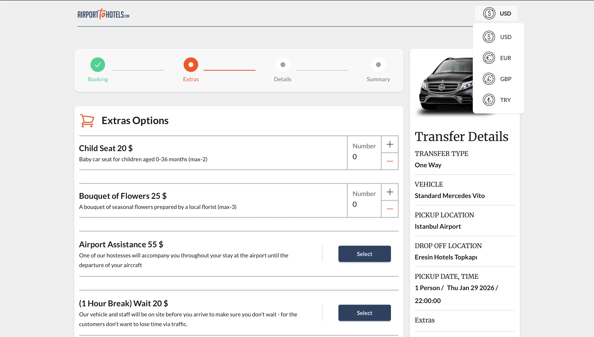
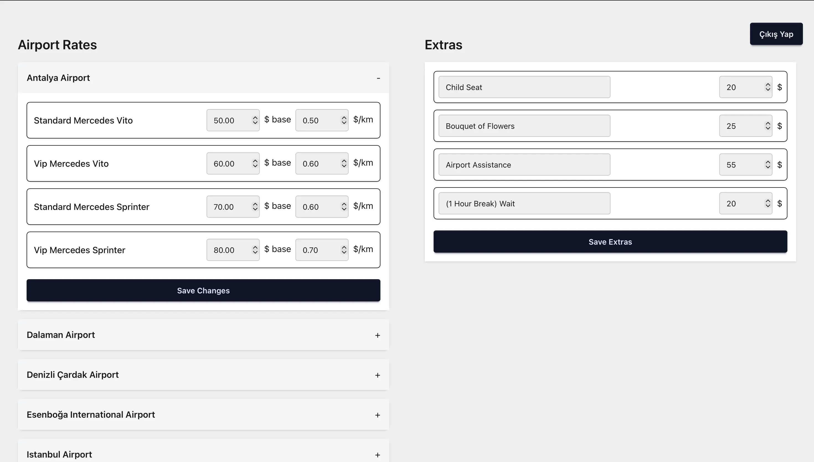

# AirportToHotels — Airport Transfer Booking Platform

### Key Capabilities

- **SEO-first Next.js architecture**
- **Distance-based dynamic pricing**
- **Real payments (Garanti BBVA Virtual POS)**
- **Admin-controlled pricing (CMS-like panel)**
- **Step-based booking with session timeout**

A **production-grade airport transfer booking platform** with **real payments (cash / credit card)**, **distance-based pricing**, and an **SEO-first architecture**.

Live: https://www.airporttohotels.com  
Repository: https://github.com/serin-gorkem/AirportToHotelWebApp  
Developer: **Görkem Serin (Fullstack Web Developer)**

---

## Project Overview


AirportToHotels is a **real-world airport transfer booking platform** built to model how **transfer businesses actually operate**.  
The project focuses on **search visibility**, **pricing accuracy**, and a **reliable multi-step booking experience**, rather than being a demo or tutorial application.

The system is designed with **production constraints** in mind, including **real payment processing**, **server-side business logic**, and a **pricing model that scales across routes and destinations**.

---

## Architectural Goals

The architecture was shaped around a **small set of clear goals**.

The primary objective was to support **SEO-friendly rendering** for **landing and content-heavy pages** while still enabling **highly interactive booking flows**.  
Another key goal was to keep **business logic centralized and explicit**, while **avoiding unnecessary abstraction and premature service separation**.

All technical decisions prioritize **clarity**, **maintainability**, and **extensibility** over complexity.

---

## Core Architecture

The application is **built using Next.js with the App Router**, following a **hybrid architecture** where **frontend and backend logic coexist** within the same codebase but remain **clearly separated by responsibility**.

**Server-side rendering** is used for **SEO-critical pages** such as landing content, FAQs, and service descriptions.  
**Interactive booking steps are handled on the client**, while **all persistence and pricing logic runs on the server through Next.js server-side routes**.

This approach keeps deployment **simple** while preserving a **strict client–server boundary**.

---

## Booking Flow and State Management

The booking process is implemented as a **step-based flow** rather than a single large form submission.

User input is progressively collected into a shared **client-side state object (`clientData`)**.  
At each step, **partial data can be validated and synchronized with the backend**.

This design **reduces the risk of data loss**, **improves user experience**, and allows **pricing logic to react dynamically** as booking parameters change.

<p align="center">
  <strong>Booking Flow Overview</strong><br/>
  <em>Airport → Destination → Vehicle → Details → Confirmation</em>
</p>

<p align="center" style="border:1px solid #e5e7eb; padding:12px; border-radius:8px;">
  
  
  
  
</p>

<p align="center">
  <em>Step-based booking flow with incremental state collection and validation.</em>
</p>

---

## Booking Session Timeout

To ensure **consistency** and prevent **stale bookings**, each booking session has a **fixed lifetime**.

Once a user starts the booking flow, a **15-minute session window** is allocated.  
During this period, **all booking steps**, **pricing calculations**, and **payment initiation** must be completed.

If the session expires:
- **The booking state is invalidated**
- **Pricing must be recalculated**
- **The user is required to restart the booking flow**

This timeout mechanism prevents **outdated pricing**, avoids **long-lived incomplete bookings**, and aligns the system with **real-world reservation constraints**.

---

## Pricing Strategy

Pricing is implemented using a **distance-based model** that combines **persistent configuration** with **real-time calculation**.

Each airport has a predefined **base price** and a **pricing multiplier** stored in the **PostgreSQL database**.  
**The distance between the selected airport and destination is calculated using the Google Maps API**.

The final price is calculated using the following formula:
```
totalPrice = basePrice + (distance × multiplier)
```

This strategy reflects how **real airport transfer businesses price routes** and allows pricing parameters to be **adjusted without code changes**.

---

## Admin Panel and CMS Capabilities

The platform includes an **internal admin panel** that allows **backend data to be managed directly** through a dedicated frontend interface.

An **`/admin` route** is used to access the panel, protected by **username and password authentication**.  
This interface acts as a **lightweight CMS**, enabling **operational control without requiring code changes**.

Through the admin panel:
- **Airport base prices and pricing multipliers can be updated**
- **Pricing behavior can be adjusted in real time**
- **Changes are persisted directly to the database and reflected immediately on the booking flow**
- The admin panel is intended for internal operational use and is not publicly exposed.

This setup enables **non-developer operational updates** while keeping **business logic centralized and server-authoritative**.

<p align="center" style="border:1px solid #e5e7eb; padding:12px; border-radius:8px;">
  
  
</p>

---

## Payment Integration

The platform supports **online credit card payments** through **Garanti BBVA Virtual POS**.

All payment operations are handled **server-side** within the **Next.js backend**.  
**Sensitive credentials and payment signing logic never reach the client**.

The frontend only **initiates the payment process** and receives the **final confirmation result**.  
Bookings are finalized **only after successful payment validation**.

This integration enables **real transactional flows** using a **bank-backed payment system**.

```
Payment Flow: Client → Server → Garanti BBVA → Confirmation
```

---

## Backend and Data Layer

**All business logic and database access are executed server-side**.

**PostgreSQL** is used to model **relational data** such as **airports**, **pricing parameters**, and **bookings**.  
**Neon provides a serverless PostgreSQL environment** that integrates cleanly with **Vercel deployments**.

Database access is handled using **direct SQL queries via the `pg` library**, favoring **explicit control and transparency** over heavy ORM abstractions.

---

## UI and Interaction

The user interface is built with **Tailwind CSS** using a **utility-first styling approach**.  
**daisyUI** provides **consistent UI primitives** such as buttons, modals, and layout components.

**Framer Motion is used selectively** to improve **transitions and feedback** within the booking flow without introducing unnecessary visual complexity.

---

## Technology Stack

- **Frontend & Backend:** Next.js 15, React 19, TypeScript  
- **Styling:** Tailwind CSS, daisyUI  
- **Database:** PostgreSQL (Neon)  
- **Maps & Distance:** Google Maps API  
- **Payments:** Garanti BBVA Virtual POS  
- **Email:** Nodemailer  
- **Deployment:** Vercel

---

## Design Trade-offs

**The backend is colocated with the frontend** instead of being split into a separate service to avoid **unnecessary operational complexity** at the current scale.

**Pricing rules are intentionally kept simple**, while remaining **extensible for future business rules**.

**Direct SQL is preferred over ORM abstractions** to maintain **clear visibility** over database interactions.

---

## Local Development

Clone the repository and install dependencies:

```bash
git clone https://github.com/serin-gorkem/AirportToHotelWebApp.git
cd AirportToHotelWebApp
npm install
npm run dev
```
---

## Overall Summary

**AirportToHotels demonstrates a fullstack approach to building a real booking system under practical, real-world constraints.**

The project includes **real online payments**, **distance-based pricing**, **server-side business logic**, and **SEO-oriented rendering**, combined with an **admin-controlled CMS-like panel for managing pricing without redeployment.**

A time-bound booking session model ensures pricing consistency and prevents stale reservations, reflecting how production booking systems operate in practice.

**Overall, the platform is designed to be maintainable and extensible, prioritizing clarity, operational control, and scalability over premature complexity.**

---
## Author

Görkem Serin
Fullstack Web Developer

Portfolio: https://gorkemserin.com
Email: gorkemserin@outlook.com
